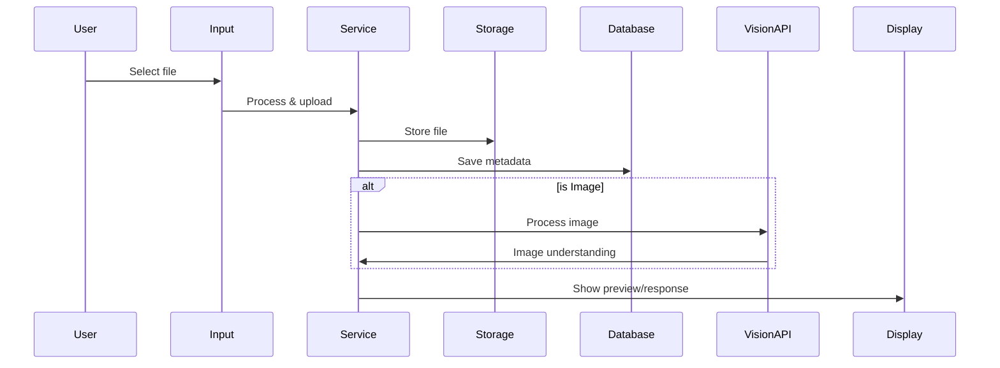

# Attachment Chat Workflow

## Part A: Main Implementation Points

### 1. Core Features
1. **File Handling**
   - Image attachments (JPEG, PNG, GIF, WebP)
     - Vision API integration for image understanding
     - Image detail control (low/high/auto)
   - Document attachments (PDF, TXT, MD)
   - Size limits and validation

2. **User Experience**
   - Drag and drop support
   - Inline previews
   - Progress indicators
   - Error feedback
   - Image analysis feedback

3. **Integration**
   - Message system compatibility
   - Streaming support
   - Chat history integration
   - Vision API integration
   - OpenAI format compatibility

### 2. Key Components
```
ChatInput
  ├── AttachmentButton   # File selection
  ├── AttachmentPreview  # Display previews
  └── MessageInput       # Text input

ChatService
  ├── Upload handling
  ├── Storage management
  ├── Vision processing
  └── Database operations

MessageProcessor
  ├── Text formatting
  ├── Image conversion
  └── OpenAI format

MessageDisplay
  ├── Image rendering
  ├── Vision responses
  └── Document handling
```

### 3. Data Flow


### 4. Implementation Phases
1. **Phase 1: Core Upload**
   - File selection
   - Basic validation
   - Storage setup

2. **Phase 2: Display**
   - Preview generation
   - Inline display
   - Download options

3. **Phase 3: Integration**
   - Message system
   - Chat context
   - Model integration
   - Vision API integration

4. **Phase 4: Polish**
   - Error handling
   - Performance
   - Security

## Part B: Technical Details

### 1. Component Details
```
components/
├── chat/
│   ├── input/
│   │   ├── AttachmentButton.tsx    # File selection UI
│   │   ├── ChatInput.tsx           # Main input component
│   │   └── InputActions.tsx        # Action buttons container
│   ├── conversation/
│   │   └── ChatBody.tsx           # Message display
│   ├── messages/                  # Message components
│   └── uploader/                  # File upload handling
├── ui/
│   ├── button.tsx                # Base button component
│   ├── textarea.tsx              # Base textarea component
│   ├── dialog.tsx               # Modal dialogs
│   └── progress.tsx             # Upload progress
```

### 2. Database Schema
```sql
-- Chat Attachments Table
CREATE TABLE public.chat_attachments (
  id UUID PRIMARY KEY DEFAULT uuid_generate_v4(),
  chat_id UUID NOT NULL REFERENCES public.chats(id) ON DELETE CASCADE,
  message_id UUID NOT NULL REFERENCES public.chat_history(id) ON DELETE CASCADE,
  file_path TEXT NOT NULL,
  file_type TEXT NOT NULL,
  file_name TEXT NOT NULL,
  file_size INTEGER NOT NULL,
  metadata JSONB DEFAULT '{}',
  created_at TIMESTAMP WITH TIME ZONE DEFAULT NOW(),
  updated_at TIMESTAMP WITH TIME ZONE DEFAULT NOW()
);

-- Simple indexes for performance
CREATE INDEX chat_attachments_chat_id_idx ON public.chat_attachments(chat_id);
CREATE INDEX chat_attachments_message_id_idx ON public.chat_attachments(message_id);

-- No RLS policies needed as all data is public
ALTER TABLE public.chat_attachments DISABLE ROW LEVEL SECURITY;

-- Create public storage bucket
INSERT INTO storage.buckets (id, name, public)
VALUES ('chat-attachments', 'chat-attachments', true)
ON CONFLICT (id) DO NOTHING;

-- Public storage policies
CREATE POLICY "Public access for chat attachments"
  ON storage.objects FOR ALL
  USING (bucket_id = 'chat-attachments');
```

#### Storage Structure
```
storage/
└── chat-attachments/           # Storage bucket
    ├── [chat_id]/             # Organized by chat
    │   ├── images/            # Image attachments
    │   │   └── [file_name]
    │   └── documents/         # Document attachments
    │       └── [file_name]
```

### 3. Implementation Details

#### Message Format
```typescript
interface ChatMessage {
  id: string;
  chatId: string;
  userContent: string | {
    type: 'text' | 'image_url';
    text?: string;
    image_url?: {
      url: string;
      detail?: 'low' | 'high' | 'auto';
    };
  }[];
  assistantContent: string;
  attachments?: Array<{
    id: string;
    file_path: string;
    file_type: string;
    file_name: string;
    file_size: number;
    metadata: {
      mimeType: string;
      position?: number;
      dimensions?: { width: number; height: number }; // for images
      pageCount?: number; // for documents
      textContent?: string; // for documents
      imageDetail?: 'low' | 'high' | 'auto'; // for vision API
    };
  }>;
}
```

#### Component State
```typescript
interface AttachmentState {
  files: Array<{
    id: string;
    file: File;
    type: 'image' | 'document';
    preview?: string;
    base64?: string;
    position: number;
    metadata: {
      path: string;
      size: number;
      mimeType: string;
      imageDetail?: 'low' | 'high' | 'auto';
    };
  }>;
}

interface ChatInputState {
  content: string;
  attachments: AttachmentState;
  isSending: boolean;
}
```

#### Message Processing Flow
```typescript
// 1. Attachment Processing
async function processAttachment(attachment: Attachment): Promise<MessageContent | string> {
  if (attachment.file_type.startsWith('image/')) {
    return {
      type: 'image_url',
      image_url: {
        url: attachment.file_path,
        detail: attachment.metadata.imageDetail || 'auto'
      }
    };
  }
  return `[Attachment: ${attachment.file_name} (${attachment.file_type})]`;
}

// 2. Message Processing
async function processMessages(
  chatHistory: ChatMessage[],
  prompt: string,
  systemMessage: string,
  imageBase64?: string,
  imageDetail: 'low' | 'high' | 'auto' = 'auto'
): Promise<FormattedMessage[]> {
  // Process chat history
  // Handle attachments
  // Format for OpenAI
}

// 3. Vision API Integration
async function createCompletion(
  messages: FormattedMessage[],
  model: string,
  onToken?: (token: string) => void
): Promise<string> {
  // Handle both text and vision content
  // Stream responses
  // Process results
}
```

### 4. Testing Procedures

#### Upload Testing
```typescript
1. File Selection Tests:
   ✓ Click attachment button to select file
   ✓ Drag and drop file onto input area
   ✓ Try uploading invalid file types
   ✓ Try uploading files > size limit

2. Upload Progress:
   ✓ Check progress indicator appears
   ✓ Verify toast notifications
   ✓ Test cancel upload functionality

3. Vision Integration:
   ✓ Image detail selection
   ✓ Vision API responses
   ✓ Error handling
```

#### Integration Testing
```typescript
1. Message Flow:
   ✓ Attachment in correct message
   ✓ Multiple attachments
   ✓ Persistence after reload
   ✓ Chat history loading
   ✓ Vision API integration

2. Context Preservation:
   ✓ Chat context during upload
   ✓ Message pairing
   ✓ Streaming with attachments
   ✓ Vision context preservation
```

### 5. Error Handling
```typescript
// Client-Side Validation
try {
  if (file.size > MAX_SIZE) {
    throw new Error('File size exceeds limit');
  }
  if (!ALLOWED_TYPES.includes(file.type)) {
    throw new Error('Unsupported file type');
  }
  await handleUpload(file);
} catch (error) {
  toast.error(error.message);
} finally {
  setIsUploading(false);
}

// Vision API Error Handling
try {
  const response = await createCompletion(messages, model);
  if (!response) throw new Error('Failed to process image');
} catch (error) {
  handleVisionError(error);
}
```

## Part C: Reference

### 1. Security Policies
1. **Database Access:**
   - All data is publicly accessible
   - Default user for operations
   - No authentication required

2. **Storage Access:**
   - Public bucket for attachments
   - Open read/write access
   - Basic file validation only

3. **Safety Measures:**
   - File size limits
   - File type validation
   - Content validation (optional)
   ```typescript
   const ALLOWED_TYPES = [
     // Images
     'image/jpeg', 'image/png', 'image/gif', 'image/webp',
     // Documents
     'application/pdf', 'text/plain', 'text/markdown'
   ];
   
   const MAX_FILE_SIZES = {
     image: 5 * 1024 * 1024,    // 5MB
     document: 10 * 1024 * 1024 // 10MB
   };
   ```

### 2. Testing Checklist
- [ ] Basic file upload and download
- [ ] Image preview generation
- [ ] Document handling
- [ ] Vision API integration
- [ ] Error scenarios
- [ ] Performance testing
- [ ] Security validation

### 3. Performance Considerations
- Progressive loading for large files
- Image optimization
- Vision API caching
- Response streaming
- Lazy loading in chat history

### 4. Data Flow Diagrams

#### Attachment Flow
```
User Input
↓
Attachment System ────────────┐
(handles file upload,        │
storage, and metadata)       │
                            ↓
                     Message Processing
                     (converts attachments
                      to appropriate format)
                            ↓
                     Vision API Call
                     (handles both stored
                      and base64 images)
                            ↓
                     Chat Message
                     (stores result with
                      proper metadata)
```

#### Vision Chat Flow
```
User Input (imageFile + prompt)
↓
AnswerQuestionOptions (includes imageDetail)
↓
messageProcessor (converts to base64 + OpenAI format)
↓
completionService (handles vision API calls)
↓
ChatMessage (stores result with metadata)