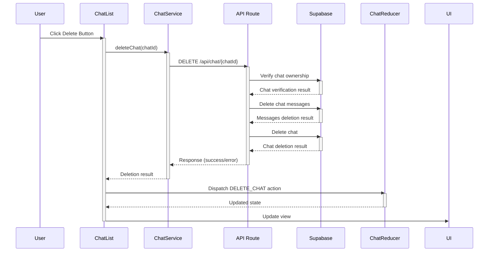

# Chat Deletion Flow

## Sequence Diagram

## Component Breakdown

### 1. UI Layer (ChatList.tsx)
- Handles user interaction through delete button click
- Calls `ChatService.deleteChat()` with chat ID
- Dispatches `DELETE_CHAT` action to reducer
- Shows success/error toast messages to user
- Updates UI based on reducer state changes

### 2. Service Layer (ChatService.ts)
- Makes DELETE request to API endpoint `/api/chat/{chatId}`
- Handles API response and error scenarios
- Returns success/failure result to caller
- Manages error logging and error object creation

### 3. API Layer (route.ts)
- Verifies chat ownership using user ID
- Performs deletion in correct order:
  1. Verifies chat exists and belongs to user
  2. Deletes all messages from chat_history table
  3. Deletes chat from chats table
- Returns appropriate HTTP responses with status codes

### 4. State Management (chatReducer.ts)
- Handles `DELETE_CHAT` action
- Updates application state by:
  - Removing deleted chat from chats array
  - Updating current chat if deleted
  - Clearing messages if current chat was deleted
- Returns updated state to components

### 5. Database Layer (Supabase)
- Executes deletion queries
- Maintains referential integrity
- Returns operation results to API layer
- Handles database-level errors

## Flow Description

1. User initiates deletion by clicking delete button in chat list
2. ChatList component prevents default actions and handles the click
3. ChatService makes API call to delete endpoint
4. API Route Handler verifies ownership and processes deletion
5. Database executes deletion in correct order
6. Success/error propagates back through layers
7. UI updates to reflect changes through reducer

## Error Handling

- Each layer includes proper error handling:
  - UI shows toast messages for success/failure
  - Service layer catches and transforms API errors
  - API layer returns appropriate HTTP error codes
  - Database operations are wrapped in error handling
  - State updates include error state management

## Security Considerations

- Chat ownership verification before deletion
- User authentication check in API route
- Database-level user ID constraints
- Proper error message sanitization 