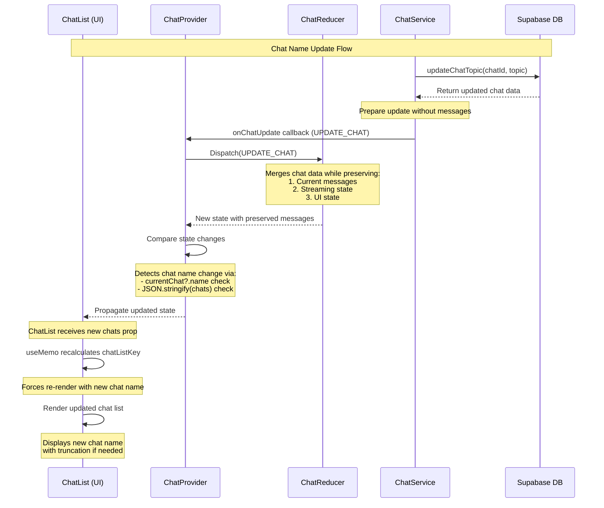

# Chat Name Update Workflow

This document describes the workflow of how chat names are updated and displayed in the CIRA AI Chatbot system.

## Sequence Diagram

## Component Responsibilities

### 1. ChatService
- Initiates the chat topic update process
- Communicates with Supabase database
- Handles API calls and data transformation
- Triggers callbacks for state updates
- Prepares chat updates without fetching messages

### 2. ChatProvider
- Manages global chat state
- Handles state comparisons for updates
- Dispatches actions to the reducer
- Provides context to child components
- Optimizes re-renders through state comparison

### 3. ChatReducer
- Processes chat state updates
- Maintains state consistency
- Handles different types of chat actions
- Returns new state for the provider
- Preserves messages during chat name updates
- Maintains streaming state during updates

### 4. ChatList (UI)
- Displays the list of chats
- Handles chat name truncation
- Manages efficient re-rendering
- Provides debug logging for updates

## Update Flow Details

1. **Update Initiation**
   - ChatService calls `updateChatTopic` with new topic
   - Updates are made to both chat and chat_history tables
   - Database returns updated chat data
   - Service prepares update without fetching messages

2. **State Management**
   - Provider receives update via callback with UPDATE_CHAT action
   - Reducer merges chat data while preserving current messages
   - Streaming state is maintained during update
   - Provider compares states for important changes

3. **UI Updates**
   - ChatList receives new chat data through props
   - Current messages remain unchanged in the UI
   - Component re-renders with new chat name
   - Truncates names longer than 30 characters

## Key Features

### Optimization
- Memoization to prevent unnecessary re-renders
- Efficient state comparison in provider
- Smart key generation for list items
- Avoids unnecessary message fetching

### Debugging
- Debug logging at critical points
- State change tracking
- Chat update monitoring
- Message preservation logging

### Data Consistency
- Maintains chat messages during updates
- Preserves streaming state
- Ensures database synchronization
- Preserves existing functionality
- Maintains message state during name updates

## Best Practices

1. **State Updates**
   - Use proper action types
   - Maintain immutability
   - Compare states efficiently
   - Preserve existing state when updating

2. **UI Rendering**
   - Implement proper memoization
   - Use efficient key generation
   - Handle edge cases (null/undefined)
   - Maintain UI state during updates

3. **Error Handling**
   - Graceful fallbacks
   - Error state management
   - Debug logging
   - State recovery on error

## Implementation Notes

The implementation ensures that chat name updates are:
- Immediately reflected in the UI
- Efficiently processed without unnecessary re-renders
- Properly persisted in the database
- Maintained across component re-mounts
- Do not interrupt ongoing message streaming
- Preserve current message state

This workflow maintains the balance between performance and functionality while ensuring a smooth user experience during chat name updates. The key improvement is the preservation of message state during name updates, preventing any interruption to the user experience. 